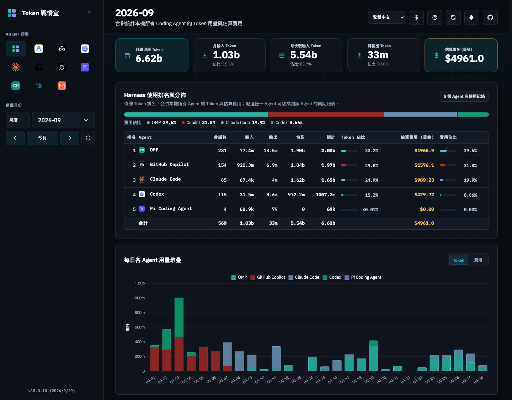
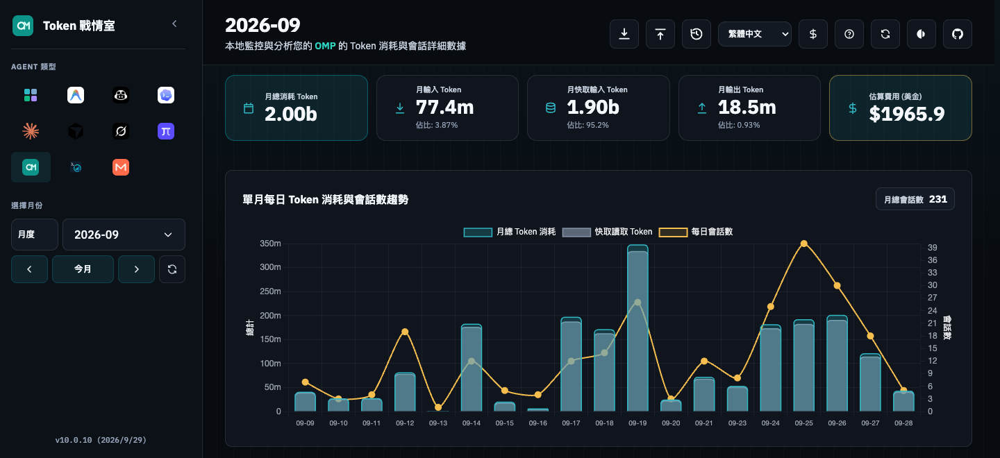
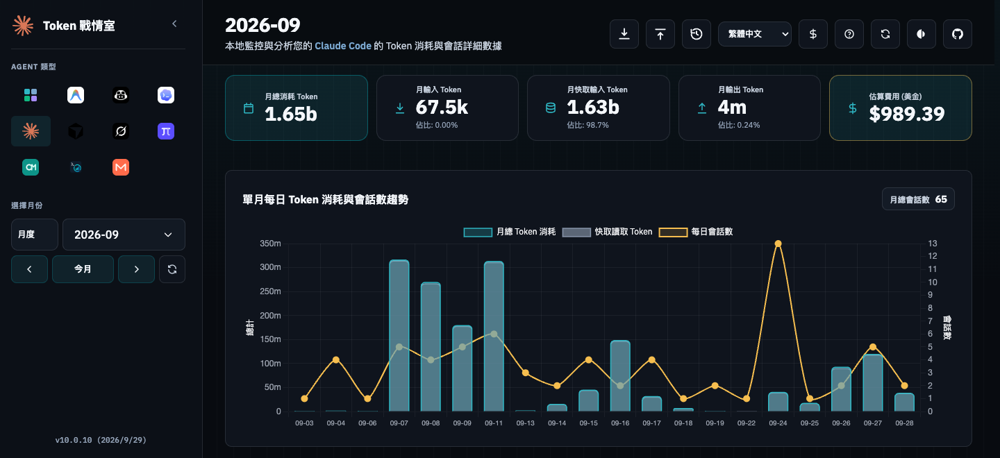

# Token War Room

Token War Room is a local-first dashboard for AI coding-agent usage. It imports local usage records into SQLite and shows token counts, estimated costs, and session timelines.

This repository is the `fun-ed` fork. Its behavior is defined by [docs/fork-spec.md](docs/fork-spec.md), not by the upstream project. It supports macOS and Linux only and has no CI/CD; releases are built and uploaded manually.

English is the canonical README. Short translations are available in [繁體中文](README.zh-TW.md) and [简体中文](README.zh-CN.md).

## Screenshots

The sidebar **Overview** (總覽) combines every agent, including all Claude Code and OMP profiles. It ranks harnesses by total tokens, shows token and cost shares, and stacks daily usage by agent:



Single-agent monthly reports for OMP and Claude Code:





## Install a precompiled CLI on macOS

The [v10.0.13 release](https://github.com/fun-ed/TokenUsageInsights/releases/tag/v10.0.13) provides CLI packages for Apple Silicon (`aarch64-apple-darwin`) and Intel (`x86_64-apple-darwin`) Macs. No Rust toolchain is needed.

For a quick local install from this fork's latest release (not the upstream repository), run:

```bash
curl -fsSL https://raw.githubusercontent.com/fun-ed/TokenUsageInsights/main/scripts/get.sh | bash && "$HOME/.local/bin/token-usage-insights"
```

The installer selects the matching macOS CLI, copies the dashboard into `~/.local/share/token-usage-insights`, and links the executable at `~/.local/bin/token-usage-insights`. Open <http://localhost:3003> if the browser does not open automatically.

To verify the checksum before installing, download the release package manually (set `target=x86_64-apple-darwin` on an Intel Mac):

```bash
version=v10.0.13
target=aarch64-apple-darwin
archive="token-usage-insights-${version}-${target}.tar.gz"
mkdir -p "$HOME/Downloads/token-usage-insights"
cd "$HOME/Downloads/token-usage-insights"
curl -fLO "https://github.com/fun-ed/TokenUsageInsights/releases/download/${version}/${archive}"
curl -fLO "https://github.com/fun-ed/TokenUsageInsights/releases/download/${version}/SHA256SUMS"
grep -F "  ${archive}" SHA256SUMS | shasum -a 256 -c -
tar -xzf "$archive"
bash "token-usage-insights-${version}-${target}/scripts/install.sh"
"$HOME/.local/bin/token-usage-insights" --version
"$HOME/.local/bin/token-usage-insights"
```

To invoke the CLI by name from zsh, add `export PATH="$HOME/.local/bin:$PATH"` to `~/.zshrc` and start a new terminal. Run the quick installer again to upgrade. Both architectures are also available as [Apple Silicon DMG](https://github.com/fun-ed/TokenUsageInsights/releases/download/v10.0.13/token-usage-insights-v10.0.13-aarch64-apple-darwin.dmg) and [Intel DMG](https://github.com/fun-ed/TokenUsageInsights/releases/download/v10.0.13/token-usage-insights-v10.0.13-x86_64-apple-darwin.dmg). For Linux, build from source unless a matching Linux asset is listed in the release.

## Import automatically in the background

The dashboard imports new records while the server is running. To keep it running after login, install it as a user service from an extracted release package:

```bash
bash "token-usage-insights-${version}-${target}/scripts/install.sh" --service
```

On macOS this installs the launchd agent `com.tokenusageinsights`; on Linux it installs a systemd user service. The service listens on `0.0.0.0:3003` by default, which exposes the dashboard to your local network. Set `HOST=127.0.0.1` before the command to keep it local. Do not run `install.sh` from inside the install directory.

## Run from source

```bash
git clone https://github.com/fun-ed/TokenUsageInsights.git
cd TokenUsageInsights
cargo run --release
```

Open <http://localhost:3003>.

## What it reads

The dashboard reads local data from Antigravity, Copilot, Codex, Claude Code, Cursor, Grok Build, Pi, OMP, Muse Code, and MiniMax Code. It supports macOS and Linux.

### Claude Code profiles

Claude Code usage is read from `~/.claude` and from every `~/.claude-profiles/<name>/` directory that contains `projects/`. New profiles are picked up on the next sync. The dashboard labels each session with its source: `Default` or the profile name, such as `work` or `p2`. Setting `CLAUDE_DIR` reads only that directory and skips profile discovery.

Only transcripts that still exist can be imported. Claude Code deletes transcripts after 30 days by default, so set `"cleanupPeriodDays": 365` in each profile's `settings.json`.

### OMP profiles

OMP usage is read from source root `~/.omp` (sessions at `~/.omp/agent/sessions`) and every source root `~/.omp/profiles/<name>/` (sessions at `agent/sessions`). Profiles are rediscovered on each sync, so newly created profiles are imported automatically. Setting `OMP_DIR` reads only that configured OMP root and disables profile discovery.

The default source keeps the backward-compatible `source_kind` `omp-session`; profiles use `omp-profile:<name>`, and [additional OMP roots](#additional-sources-multiple-homes-and-computers) use `omp-source:<hex path>`. Each source retains independent database identity. Token usage (including per-turn `usage.cost`) comes from session JSONL files, not binary blobs or SQLite usage extraction.

### Additional sources: multiple homes and computers

Add `additional_sources` to `config.yaml` to scan extra data roots for any tool, such as a second `CODEX_HOME` or folders that a cloud drive syncs from other computers:

```yaml
additional_sources:
  codex: ['~/work-codex', '~/Cloud Drive/laptop/.codex']
  claude: ['~/Cloud Drive/laptop/.claude']
  omp: ['~/Cloud Drive/laptop/.omp']
  copilot: ['~/Cloud Drive/laptop/.copilot']
```

- Keys: `antigravity`, `copilot`, `copilot_app`, `vscode`, `codex`, `claude`, `cursor`, `grok`, `pi`, `omp`, `muse`, `mcode`. Each path is a tool root with its usual layout: `codex` → `sessions/` and `archived_sessions/`; `claude`, `cursor` → `projects/`; `pi`, `omp` → `agent/sessions/`; `grok`, `muse`, `mcode` → `sessions/`; `vscode` → a VS Code user data root containing `User/workspaceStorage/`.
- Extra roots **extend** the default sources, Claude Code profiles, and OMP profiles. `*_DIR` variables still choose the primary root.
- Each extra Claude Code or OMP root is a separate source. The dashboard labels its sessions with the last two path components, for example `laptop/.claude`.
- Paths accept absolute paths, `~`, and `$HOME`. Relative paths resolve against the config file's directory. Repeated paths and symlinks to the same directory are scanned once; missing directories are skipped until they appear.
- Startup, background sync, and **Sync Now** reload the file, so no restart is needed. Removing a source keeps the usage already imported.
- The first existing `config.yaml` wins: the insights directory (`INSIGHTS_DIR` if set), `~/.token-usage-insights/`, then the working directory. Invalid YAML makes sync fail with the file path instead of silently using defaults.

### Privacy and pricing

It does not send usage logs to AI providers. Prices are estimates. When a source does not report a cost, the dashboard uses a matching local pricing rule. The server refreshes its models.dev price cache when available.

On Daily, `manifest/auto` sessions default to 0 USD. Select `glm-5.3`, `deepseek-v4.1-flash`, or `glm-5.3-flash` in the session's estimated-cost model selector to save a pricing choice in SQLite and refresh the costs. The choice applies only to that source and session across all dates, survives synchronization and restarts, and leaves the original model display and source logs unchanged. Select the 0 USD default to clear it. The Overview remains read-only.

## Development

```bash
make fmt
make check
make test
make test-scripts   # install.sh systemd unit tests (no systemd needed)
```
